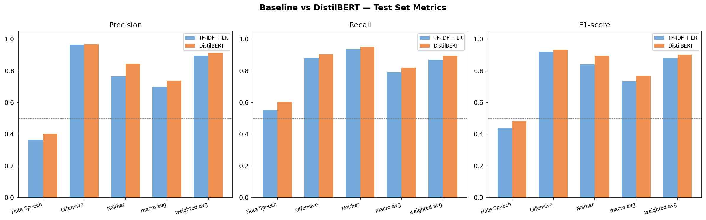
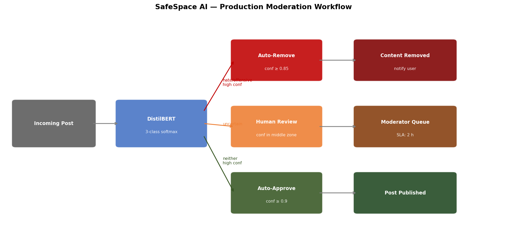
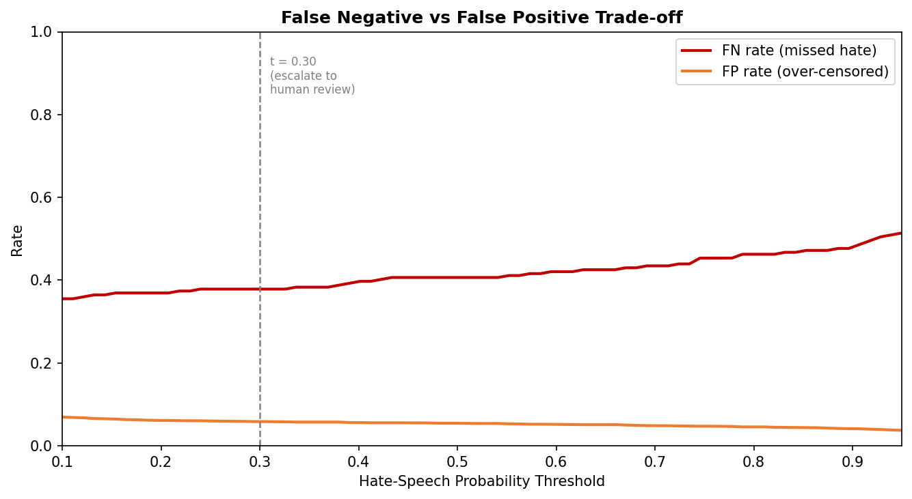

# Mini Project IX: Content Moderation with Transformers

## Overview

This project develops an automated content moderation system for social media platforms, utilizing machine learning to classify text into three categories: Hate Speech, Offensive Language, and Neither. By comparing a traditional TF-IDF + Logistic Regression baseline against a fine-tuned DistilBERT transformer model, the project evaluates performance, analyzes errors, and designs a production-ready moderation workflow. The system addresses the critical need for scalable, accurate moderation to reduce human workload and mitigate harmful content dissemination.

## Problem Description and Motivation

Content moderation is essential for maintaining safe online environments, yet manual processes are inefficient and psychologically taxing. Platforms face regulatory pressures to remove hate speech while avoiding over-censorship of legitimate expression. This project automates moderation using NLP, focusing on distinguishing hate speech from offensive language—a nuanced task with legal implications. Motivation stems from the volume of user-generated content and the need for AI-driven solutions to enhance safety without compromising free speech.

## Dataset Description

The dataset is the "Hate Speech and Offensive Language" collection from Davidson et al. (2017), comprising approximately 24,782 labeled tweets. It includes three classes: Hate Speech (0), Offensive Language (1), and Neither (2), with a significant imbalance (5% hate speech, 77% offensive, 18% neither). Tweets contain slang, URLs, mentions, and hashtags, reflecting real-world social media noise.

**Source**: [Hate Speech and Offensive Language Dataset](https://github.com/t-davidson/hate-speech-and-offensive-language) (GitHub repository).

## Setup Instructions and How to Run

### Prerequisites
- Python 3.8 or higher
- Jupyter Notebook or JupyterLab
- Git for repository cloning

### Installation
1. Clone the repository:
   ```
   git clone https://github.com/Ledja22/mini-project-9.git
   cd mini-project-9
   ```

2. Install dependencies:
   ```
   pip install -r requirements.txt
   ```

### Execution
Run the notebooks sequentially in a Jupyter environment:
1. `notebooks/01_exploration.ipynb`: Data loading, preprocessing, and splitting.
2. `notebooks/02_baseline.ipynb`: Baseline model training and evaluation.
3. `notebooks/03_transformer.ipynb`: Transformer fine-tuning, comparison, and workflow design.

Ensure the `data/` directory exists for outputs. The project is designed for Google Colab compatibility.

## Results Summary: Baseline vs Transformer Comparison

The transformer model outperforms the baseline across all metrics, particularly for the minority Hate Speech class.

| Metric       | Model          | Hate Speech | Offensive | Neither | Macro Avg | Weighted Avg |
|--------------|----------------|-------------|-----------|---------|-----------|--------------|
| **Precision**| TF-IDF + LR   | 0.36       | 0.96     | 0.76   | 0.70     | 0.90        |
|              | DistilBERT    | 0.40       | 0.97     | 0.84   | 0.74     | 0.91        |
| **Recall**   | TF-IDF + LR   | 0.55       | 0.88     | 0.94   | 0.79     | 0.87        |
|              | DistilBERT    | 0.60       | 0.90     | 0.95   | 0.82     | 0.89        |
| **F1-Score** | TF-IDF + LR   | 0.44       | 0.92     | 0.84   | 0.73     | 0.88        |
|              | DistilBERT    | 0.48       | 0.93     | 0.89   | 0.77     | 0.90        |


## Detailed Analysis

The evaluation metrics reveal DistilBERT's strengths in handling imbalanced classes, with improved precision and recall for Hate Speech detection compared to the TF-IDF baseline. Confusion matrices highlight the baseline's tendency to misclassify Hate Speech as Offensive, while DistilBERT reduces false negatives for harmful content. Confidence analysis plots accuracy against coverage at varying thresholds, demonstrating a trade-off where higher thresholds yield purer predictions but cover fewer samples, informing production deployment decisions.

## Model comparisons 


Error analysis categorizes over 10 misclassified examples into patterns such as sarcasm/irony, context-dependency, and slang usage, underscoring transformers' limitations with nuanced language. The production workflow design incorporates three zones—auto-remove, human review, and auto-approve—based on confidence scores, with asymmetric thresholds prioritizing safety for hate speech. Scalability estimates for 100K daily posts indicate efficient human moderation needs, while recommendations for v2 include multilingual support and active learning to address evolving slang and annotation noise. More analysis can be found on the D2L report. 

## Workflow diagram 


## Cost Tradeoff 


## Team Member Contributions

- **Ledja Halltari**: Data preprocessing, model development, evaluation, error analysis, workflow design, and documentation.

- **Yansong Jia and Ledja Halltari**: D2L report, analysis 